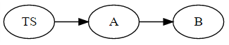
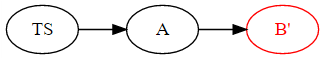
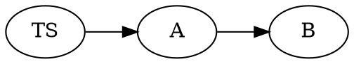
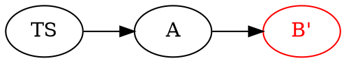

# NDeepSubrogate

DeepSubrogate is integration testing framework (.NET), which goes hand in hand with dependecy injection/IoC containers, for substituting objects in an object graph. Objects are substituted, using predefined rules, with objects called `Surrogates` that may be `Mocks` or `Spies`. The verb used to refer replacing one object with another is **to subrogate**. As objects might be replaced very deep within an object graph, we called this process **deep subrogate**. When done, the original objects can be restored back leaving the object graph in its original state.

An object graph is specified with an initial object that belongs to the graph. The graph is traversed starting from that initial object replacing the desired objects with the corresponding surrogate.


## General Idea

Normally, when doing unit tests, let us say with [NUnit](https://www.nunit.org/), we have a test suite class that contain all the test methods that make assertions on the expected object's behavior. Such test suite class instance, *TS*, contains a reference to an object whose behavior we want to test. Let us call it *A*. Now, *A* uses another object of class *B* to implement its logic. This gives the following object graph, starting from *TS*:



When testing *A*, we might want to mock *B* to test *A's* behavior regardless of *B's* original definition. Therefore, we replace *B* for a **surrogate**, *B'*.

```math
B' = subrogate(B)
```

The object graph now becomes



Once we are done with testing, the object graph can be restored back to its original state. DeepSubrogate remembers all the replacements and can take us back to the state before substitution. This is to make sure the rest of the tests that assume the original object graph state are not affected. As a result, in this example, DeepSubrogate would restore *B* so the object graph is back to


## Sample code (C#)

```csharp
//TODO: Add C# example
```


## Current state of development

Right now, the following Dependency Injection (DI)/Inversion of Control (IoC) containers are supported:

* [Spring.NET](https://autofac.org/)

The following DI containers are planned to be supported in the near future:

* [Autofac](https://autofac.org/)
* [Castle Windsor](http://www.castleproject.org/)
* [Microsoft QuickInject](https://github.com/Microsoft/QuickInject)

The mock/fakes framework used is [FakeItEasy](https://fakeiteasy.github.io/). Others might be easily integrated.

Although you might use NDeepSubrogate with any test framework, right now there is direct integration with [NUnit](https://www.nunit.org/). Support for [xUnit](https://xunit.github.io/) might be added in the near future.


#### Graphviz DOT for images
* Original object graph


* Subrogated object graph

